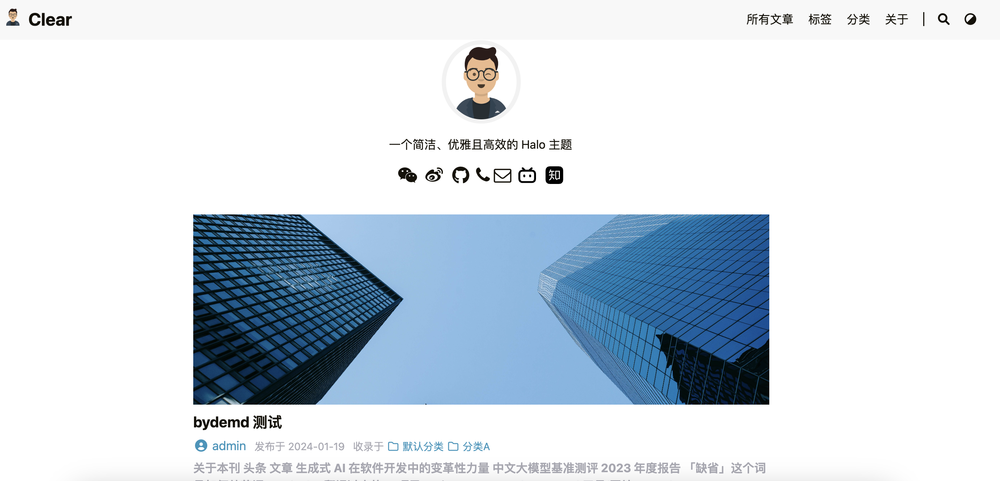
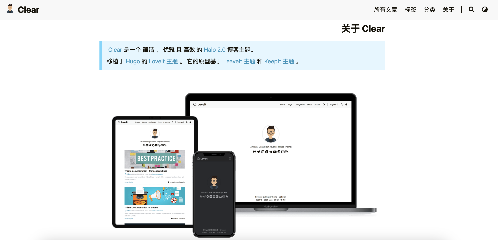

# Clear 主题使用与限制

基于 Halo2.0 开发，将当前目录压缩为 zip 包后安装

基于 [LoveIt](https://github.com/dillonzq/LoveIt) Hugo 主题模版进行开发

初始化设置步骤如下：
- [x] 如果需要展示博客内容，需要在 Console 端添加 **文章 / 标签 / 分类**，然后将文章在设置里划分到对应的标签和分类中
- [x] 该主题需要配合 Halo 官方的评论组件、搜索组件的插件使用

注：如果主题的部分样式丢失，可在 Console 端的主题 tag 菜单底部点击保存并再次刷新主题页面查看效果

预览效果

预览地址:
http://43.136.69.44:8090/

如有版权问题请联系 junhong.zhou@fit2cloud.com 进行修改

主题开发参考 [Halo官方文档](https://docs.halo.run)
